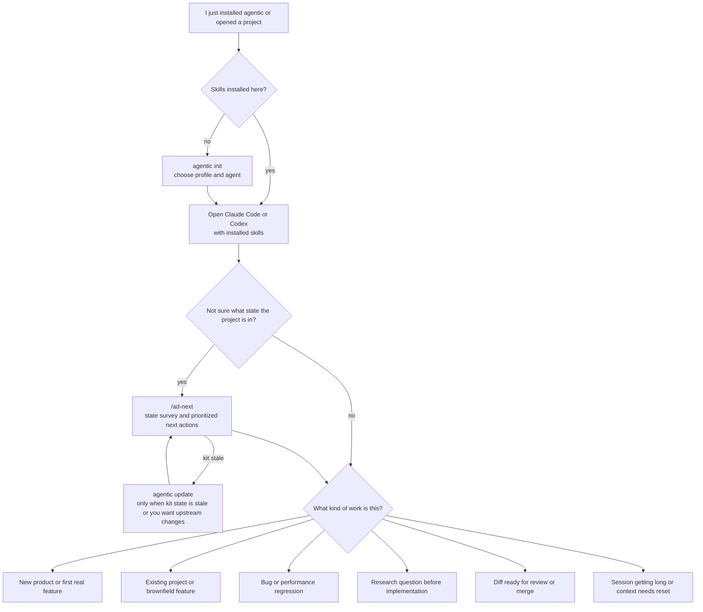
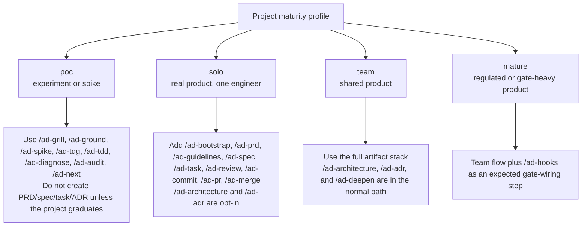
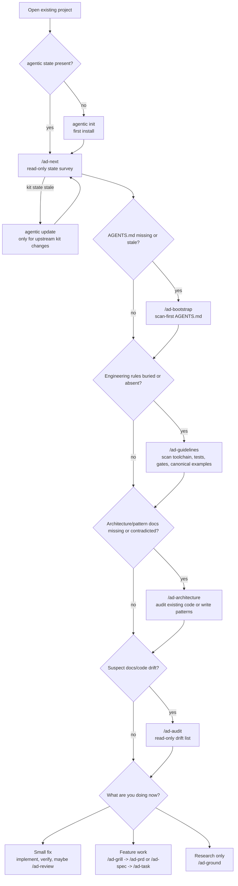
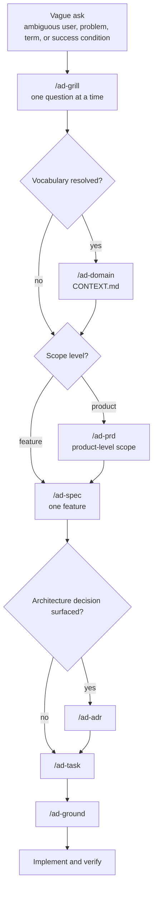
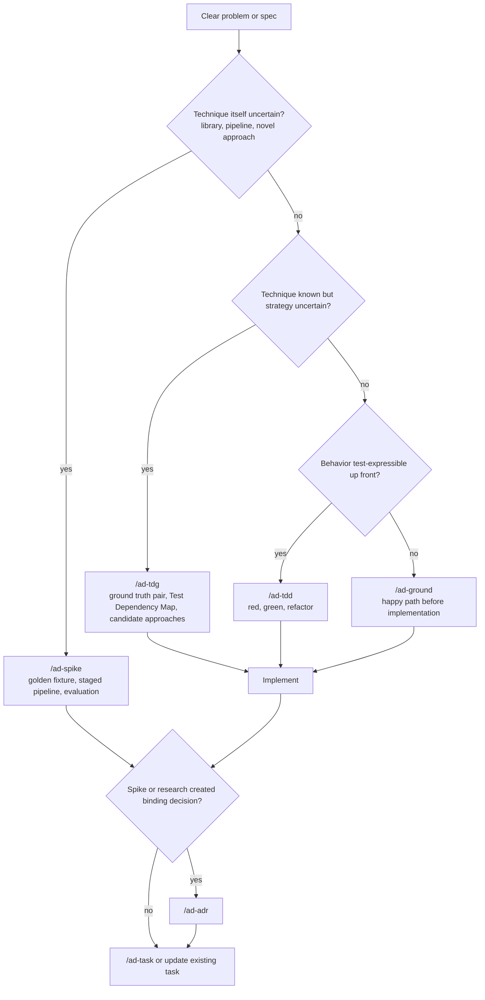
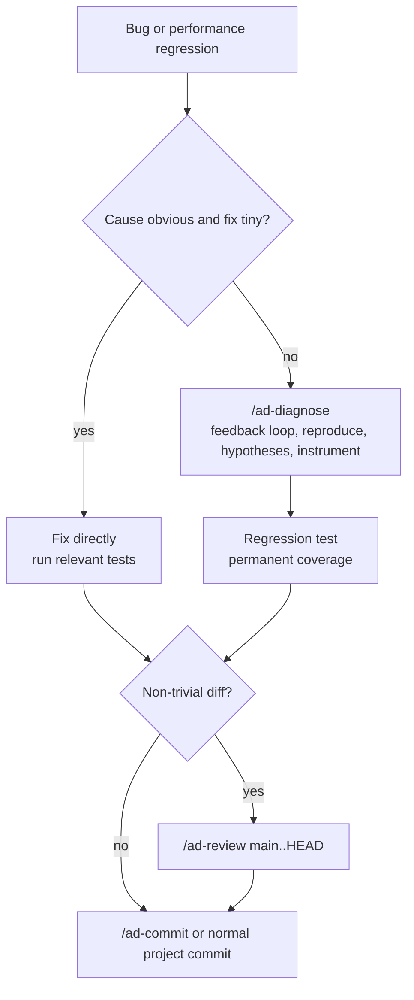
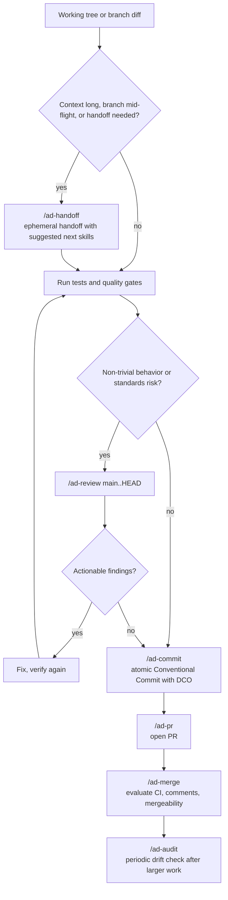
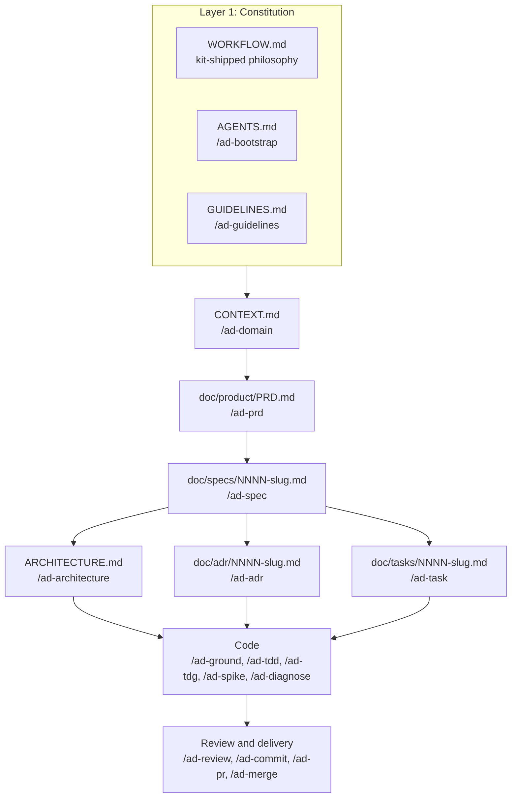

# Workflow Flows

`WORKFLOW.md` is the canonical prose contract. This file is its operational map: after installing `agentic`, use these flows to decide which skill to invoke next and in what order. If a diagram conflicts with `WORKFLOW.md`, `WORKFLOW.md` wins.

## Reading Rule

Start from your situation, not from the full artifact stack. The stack explains why the artifacts exist; the scenario flows below explain what to run next.

If you are unsure where you are, run `/ad-next`. It is read-only and exists exactly for the "what now?" moment.

## Scenario Router

Source: `WORKFLOW.md` sections 1, 4-6, 10-12, 15-16; `ad-next` skill contract.

## Profile Gate

Source: `WORKFLOW.md` section 1 and TL;DR #20.

## New Product Or First Real Feature

Use this when the project has no durable product framing yet, or when a greenfield repo is moving past a throwaway PoC.

```mermaid
flowchart TD
    Init["agentic init"]
    Bootstrap["/ad-bootstrap<br>AGENTS.md session-load rules"]
    Guidelines["/ad-guidelines<br>GUIDELINES.md engineering reference"]
    Frontend{"Frontend project with tokens or styles?"}
    Design["/ad-design<br>DESIGN.md visual contract"]
    ProductFuzzy{"Product ask fuzzy?"}
    Grill["/ad-grill<br>interview before research"]
    Domain["/ad-domain<br>capture resolved vocabulary in CONTEXT.md"]
    Prd["/ad-prd<br>product scope, target user, metrics, roadmap"]
    Feature["Pick one MVP feature"]
    Spec["/ad-spec<br>feature contract"]
    ArchitectureNeeded{"Feature creates or reveals system pattern?"}
    Architecture["/ad-architecture<br>system patterns and boundaries"]
    DecisionNeeded{"Binding decision?<br>hard to reverse, surprising, real trade-off"}
    Adr["/ad-adr<br>decision record"]
    Task["/ad-task<br>vertical work unit with Spec ref"]
    Ground["/ad-ground<br>four-source research and happy path"]
    Implement["Implement slice<br>/ad-tdd or /ad-tdg as needed"]
    Review["/ad-review main..HEAD"]
    Ship["/ad-commit -> /ad-pr -> /ad-merge<br>as project workflow requires"]

    Init --> Bootstrap
    Bootstrap --> Guidelines
    Guidelines --> Frontend
    Frontend -->|yes| Design
    Frontend -->|no| ProductFuzzy
    Design --> ProductFuzzy
    ProductFuzzy -->|yes| Grill
    Grill --> Domain
    Domain --> Prd
    ProductFuzzy -->|no| Prd
    Prd --> Feature
    Feature --> Spec
    Spec --> ArchitectureNeeded
    ArchitectureNeeded -->|yes| Architecture
    ArchitectureNeeded -->|no| DecisionNeeded
    Architecture --> DecisionNeeded
    DecisionNeeded -->|yes| Adr
    DecisionNeeded -->|no| Task
    Adr --> Task
    Task --> Ground
    Ground --> Implement
    Implement --> Review
    Review --> Ship
```

Source: `WORKFLOW.md` sections 1, 4-6, 9-12, 16.

## Brownfield First Session

Use this when the repo already has code, conventions, and maybe old docs. The first move is to inspect and backfill only what changes agent behavior.

Source: `WORKFLOW.md` sections 1, 4-6, 10-12.

## Fuzzy Ask To Implementation

Use this when the request is not sharp enough to research or implement.

Source: `WORKFLOW.md` sections 1, 4-6; `ad-grill`, `ad-domain`, `ad-prd`, `ad-spec`, `ad-task` skill contracts.

## Research And Technique Choice

Use this after the problem is clear but the implementation path is not.

Source: `WORKFLOW.md` sections 4-5, 9, 14, 16.

## Bug Or Performance Regression

Use this when something is broken and the cause is not obvious. If it is a typo-level fix, fix it directly and verify.

Source: `WORKFLOW.md` sections 10-12 and 15.

## Close The Work

Use this when code is already changed and you need to decide how to land or hand it off.

Source: `WORKFLOW.md` sections 6, 10-12.

## Artifact Stack And Owning Skills

The stack is useful after the scenario router tells you which layer you are touching.

Source: `WORKFLOW.md` section 1.
