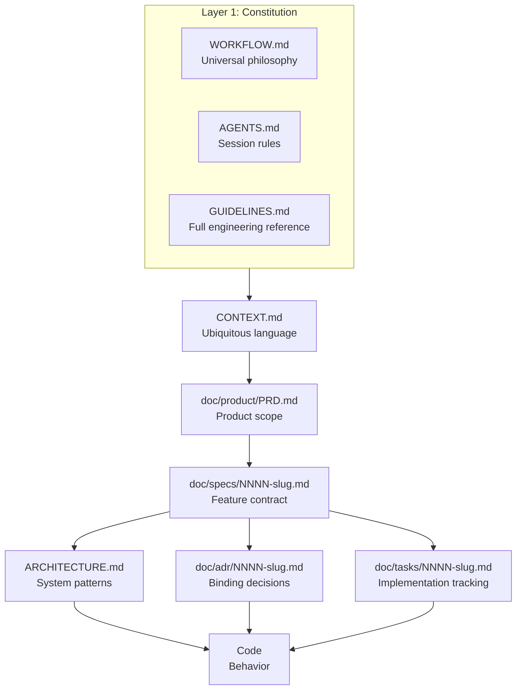
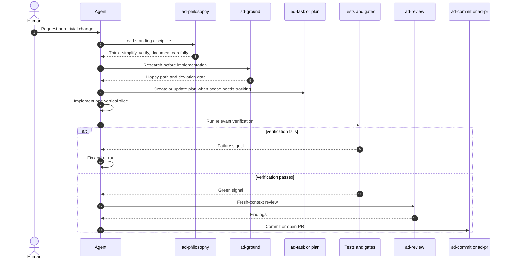
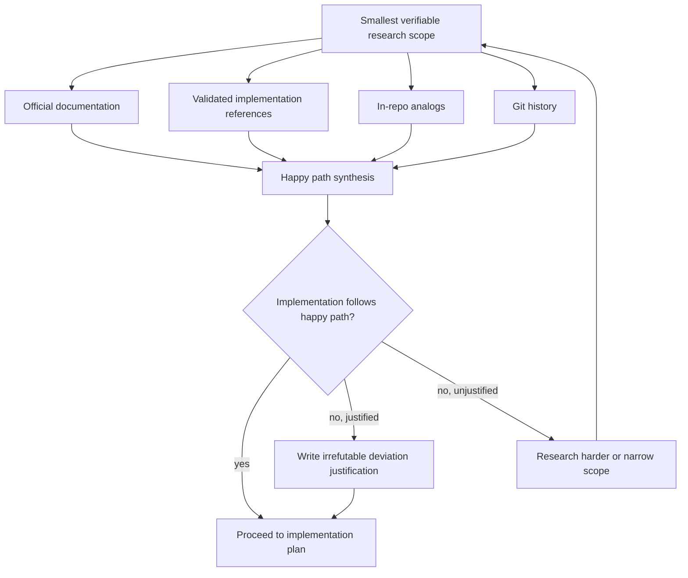
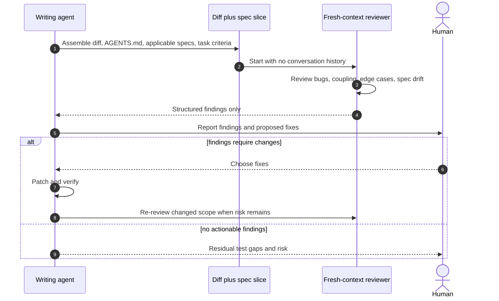
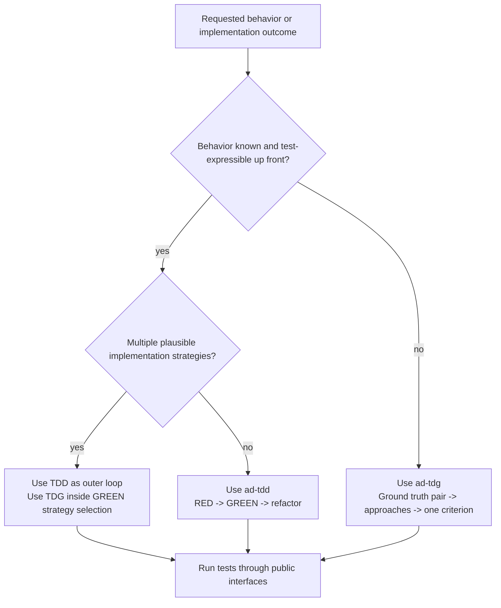
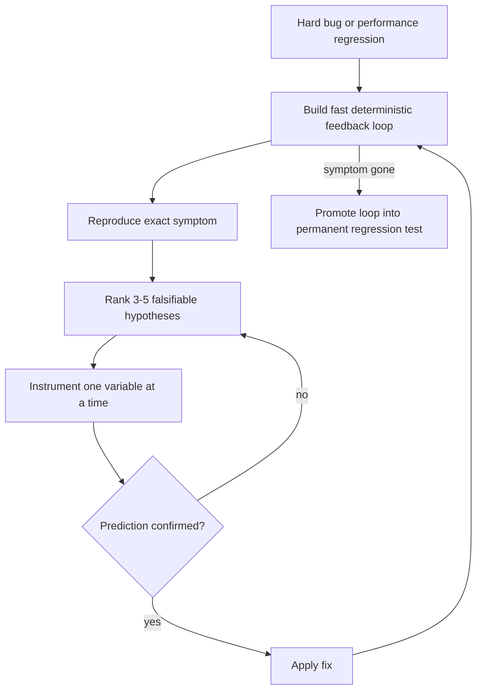
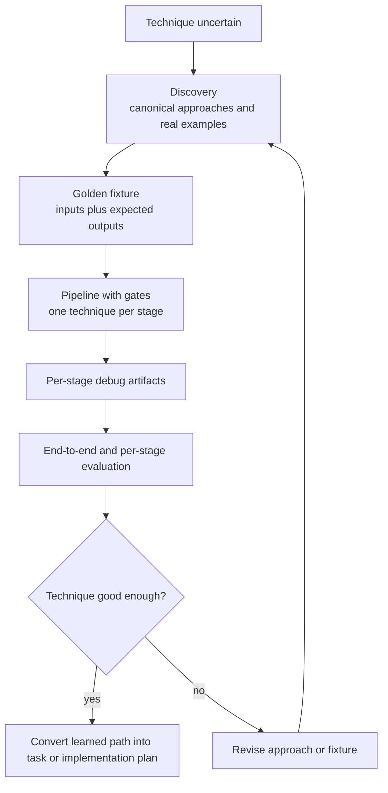

# Workflow Flows

`WORKFLOW.md` is the canonical prose contract. This file is its visual companion: it makes the repeated agent-development flows inspectable without turning the constitution into a diagram catalog. If a diagram here conflicts with `WORKFLOW.md`, `WORKFLOW.md` wins.

## Reading Rule

Each diagram is derivative. The source line beneath it names the `WORKFLOW.md` section that owns the rule; update the prose first, then update the diagram.

## Artifact Stack

Source: `WORKFLOW.md` section 1, "Six-layer artifact stack".

## Non-Trivial Change

Source: `WORKFLOW.md` sections 4-6 and 10-12.

## Research Before Implementation

Source: `WORKFLOW.md` sections 4-5.

## Fresh-Context Review

Source: `WORKFLOW.md` sections 10 and 12.

## TDD and TDG Choice

Source: `WORKFLOW.md` sections 9 and 16.

## Diagnosis Loop

Source: `WORKFLOW.md` section 15.

## Staged Spike

Source: `WORKFLOW.md` section 14.
